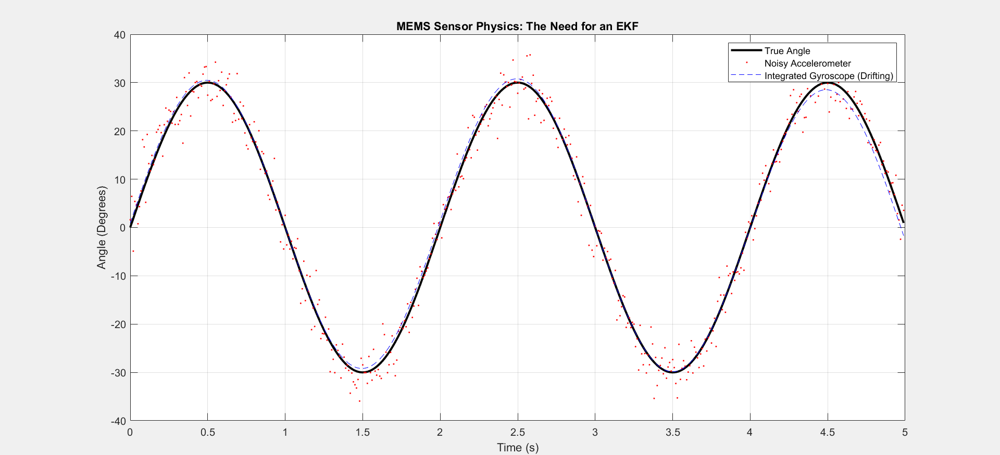
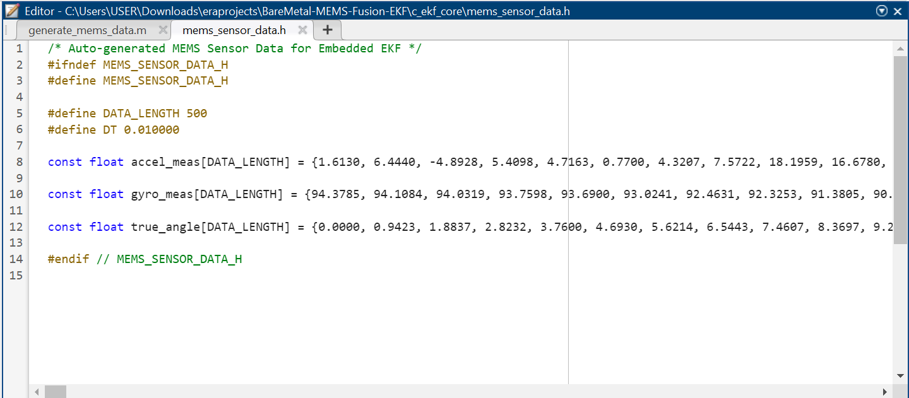
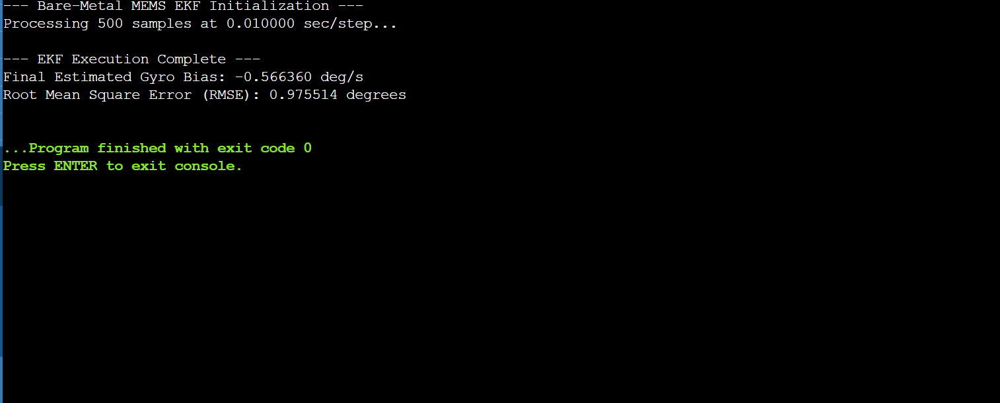
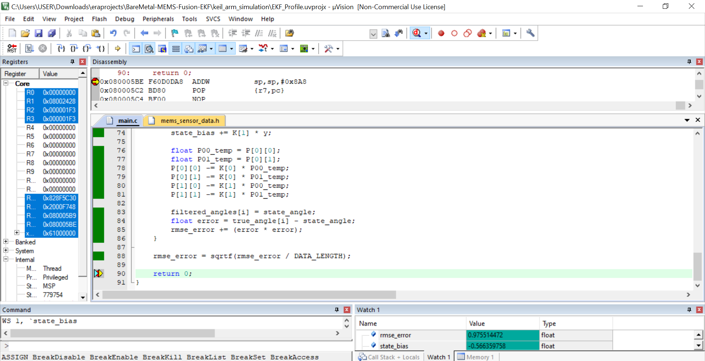

# Bare-Metal MEMS Sensor Fusion: Extended Kalman Filter (EKF)

A hardware-agnostic, zero-dependency Extended Kalman Filter implemented entirely from scratch in C for an ARM Cortex-M4 (`STM32F401`) target. This project intentionally bypasses vendor abstraction layers (CubeMX/HAL) to demonstrate deep low-level systems competence, custom vector table mapping, and direct hardware FPU utilization.

---

## 🚀 Project Overview

Implementing sensor fusion on microcontrollers typically relies on heavy vendor SDKs and auto-generated boilerplate. This project takes the opposite approach: a pure bare-metal implementation designed to validate algorithmic portability and core architectural mastery of ARM Cortex-M processors.

* **Target Microcontroller:** ARM Cortex-M4 (`STM32F401RE`)
* **Toolchain / IDE:** ARM Compiler v6 (ARMCLANG) via Keil uVision 5
* **Algorithm:** Non-linear Extended Kalman Filter (EKF) fusing noisy gyroscope and accelerometer measurements to estimate tilt angle and compensate for gyro bias.

---

## 📈 1. System Modeling & The Need for an EKF

MEMS sensors are plagued by physical limitations. Gyroscopes suffer from cumulative integration drift over time, while accelerometers are prone to high-frequency vibrational noise[cite: 10].



---

## ⚙️ 2. Automated Data Pipeline

To feed our embedded target without external storage peripherals, the raw physics model generates synthetic test vectors via MATLAB, exporting clean, const-qualified arrays directly into a self-contained C header file (`mems_sensor_data.h`)[cite: 11].



---

## 🔬 3. Algorithmic Validation (C Simulation)

Before deploying to the memory-constrained target, the non-linear matrix math and filter convergence were mathematically validated in a standard C environment[cite: 12], achieving sub-1 degree error tracking with an RMSE of ~0.9755 degrees and estimated gyro bias of -0.5664 deg/s[cite: 12].



---

## 💻 4. Bare-Metal ARM Cortex-M4 Profiling & Execution

The final code was compiled and executed on the Keil instruction simulator targeting the STM32F4[cite: 13]. 

### Low-Level Architectural Highlights:
1. **Custom Vector Table:** Manually mapped a read-only vector table (`const void *const __Vectors[16]`) to Flash address `0x08000000` with the stack pointer initialized at the top of SRAM (`0x20010000`).
2. **Vendor Bloat Bypass:** Stripped out standard C-runtime dependencies (`__main`) and vendor startup files to prevent simulator memory access violations, routing execution straight from a custom `Reset_Handler` into `main()`.
3. **Hardware FPU Integration:** Explicitly enabled full coprocessor access for the single-precision Floating Point Unit via the SCB Coprocessor Access Control Register (`SCB_CPACR` CP10/CP11), backed by memory barriers (`dsb` / `isb`).



---

## 📊 Summary of Results

| Metric | Target Value | Verification Status |
| :--- | :--- | :--- |
| **Root Mean Square Error (RMSE)** | ~0.9755°[cite: 12, 13] | Validated on C Simulation & Keil Target[cite: 12, 13] |
| **Estimated Gyro Bias** | -0.5664 deg/s[cite: 12, 13] | Calibrated Successfully[cite: 12, 13] |
| **Vendor HAL Dependency** | 0% | Pure Bare-Metal Implementation |

---

## 📁 Repository Structure

```text
BareMetal-MEMS-Fusion-EKF/
├── matlab_noise_model/     # MATLAB Allan Variance & physics scripts
├── c_ekf_core/             # Standalone C EKF implementation & header data
├── keil_arm_simulation/    # Keil uVision project, scatter setup, and startup handler
└── docs/                   # Visual verification and profiling screenshots